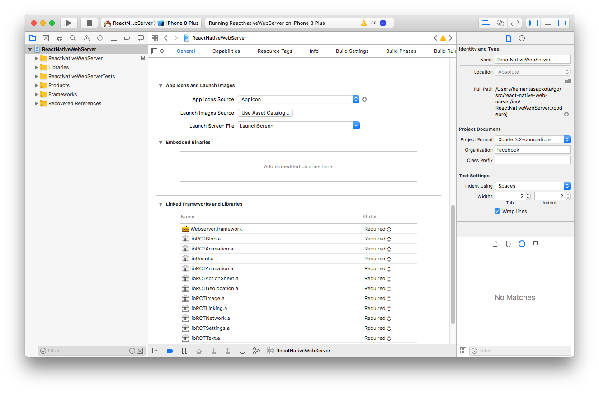

[](https://goreportcard.com/report/github.com/hemantasapkota/react-native-webserver)

# react-native-webserver
An embeddable dynamic web-server backed by Golang for React Native apps ( IOS & Android ).


## Usage

### Setup Dependencies 

```
yarn
npx pod-install
```

### Basic

```
// Import the native module
const AppWebServer = NativeModules.AppWebServer;

// Start the server
const serverUrl = await AppWebServer.start(`${RNFS.MainBundlePath}`)

// Stop the server
await AppWebServer.stop()

// Get server url
await AppWebServer.serverUrl()

// Check if server is running
const isRunning = (await AppWebServer.isRunning())

```

## How to use this project

The recommended way is to clone / fork this project and use it as a template for your react native app. See the Installation section below.

## Additional dependencies
* Golang : See https://golang.org/doc/install ( At least Go 1.7 is required )
* Gomobile: https://github.com/golang/go/wiki/Mobile

## Installing Gomobile

```
$ go get golang.org/x/mobile/cmd/gomobile
$ gomobile init # it might take a few minutes
```

See here for more details: https://github.com/golang/go/wiki/Mobile

## Installation

1. Clone the repo at `$GOPATH/src/` or `$HOME/go/src/`
2. `git clone git@github.com:hemantasapkota/react-native-web-server.git`
3. Grab node modules: `cd react-native-web-server && npm install`

## Package the webserver for IOS

1. First build the Xcode project and expect it to fail

```
open ios/ReactNativeWebServer.xcworkspace
```

If everything goes well, the first build will fail because of the missing server framework

2. Package the webserver

```
cd ../ && cd webserver
./packagemobile.sh ios
```
The output of the script is a dynamic framework called `Webserver.framework`. The script file automatically copies the generated framework to XCode's DerivedData folder.

3. Run the project



## Package the webserver for Android

```
cd ../ && cd webserver
./packagemobile.sh android
```
The output of the script is a static android archive file called `webserver.aar`. Copy `webserver.aar` to the libs folder of the andorid project.

```
mkdir -p ../android/app/libs
mv webserver.aar webserver-sources.jar ../android/app/libs
```

## Roadmap

* Enable integration as a node module for existing react native apps
* Example apps demonstrating usage
